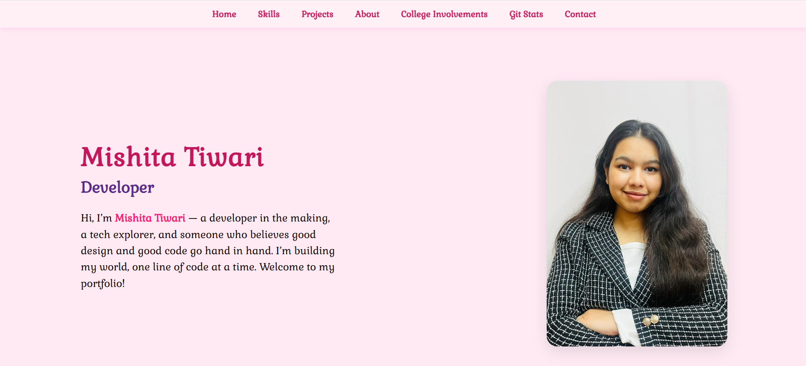
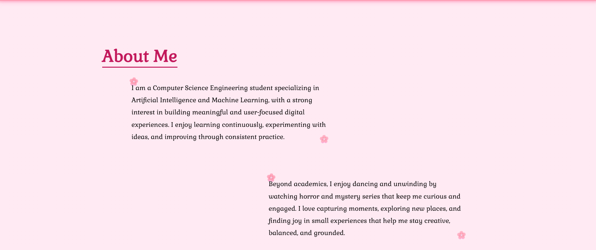
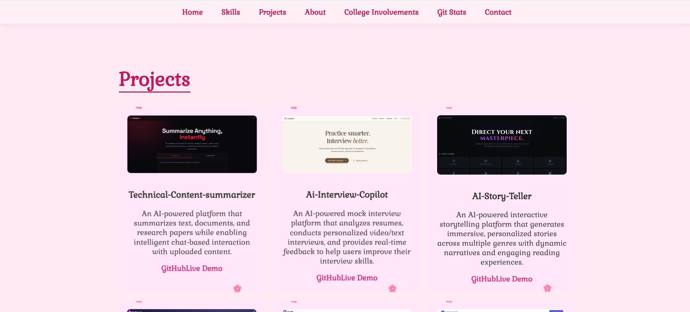
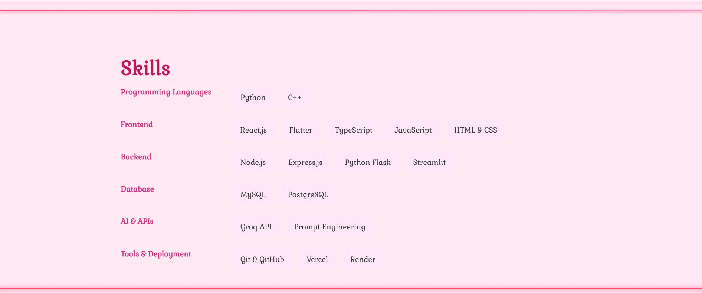

## Live Demo
[](https://my-portfolio-ruzg.vercel.app/)

# My Portfolio Website

A modern and responsive personal portfolio website designed to showcase my professional profile, technical skills, projects, and achievements in an engaging and visually appealing way.

Built with React and styled with a soft, elegant design, the website serves as a central place to present my work, experience, and interests while reflecting my personality as a developer. The portfolio focuses on clean user experience, smooth navigation, responsive layouts, and interactive elements to create a memorable browsing experience.

## Screenshots

### Home Page



### About Me



### Projects



### Skills



and other sections are also there 

## ✨ Highlights

* Modern and responsive design
* Smooth scrolling navigation
* Interactive user interface
* Mobile-friendly layout
* Clean and organized structure
* Professional presentation of personal brand
* Optimized for performance and accessibility

## 🛠️ Built With

* React.js
* JavaScript
* HTML5
* CSS3

## 🚀 Getting Started

Clone the repository:

```bash
git clone https://github.com/mishita27twr/My-Portfolio.git
```

Navigate to the project directory:

```bash
cd My-Portfolio
```

Install dependencies:

```bash
npm install
```

Run the development server:

```bash
npm start
```
## Challenges Faced

* Designing a responsive layout that works smoothly across different screen sizes and devices.
* Maintaining a consistent visual theme while ensuring readability and user experience.
* Organizing content effectively to present information in a clean and structured manner.
* Optimizing images and assets to improve loading performance.
* Implementing smooth animations without affecting website responsiveness.
* Managing deployment and resolving build issues during hosting on Vercel.

## What I Learned

Through this project, I strengthened my understanding of React, component-based architecture, responsive web design, CSS styling, deployment workflows, and creating user-friendly interfaces.

Designed and developed by **Mishita Tiwari** 

Support

If you found this project helpful, consider by giving the star .

Thank You
